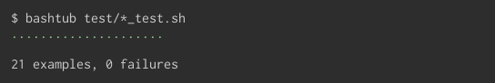
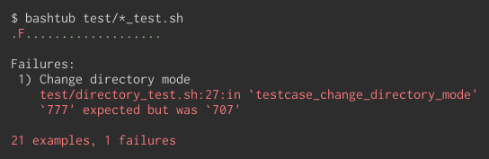

Bashtub :bathtub: - Unit test framework for Bash
================================================

[](https://travis-ci.org/ueokande/bashtub)

Bashtub is a tiny unit test framework for Bash.
You can specify the test caes as as assertion-based test cases likes xUnit.
Bashtub colorfully outputs the results of the test.
When test passed



and when tests failed, it bashtub outputs the information of the failures,



Installation
------------

```sh
curl -o ~/bin/bashtub https://github.com/gitlabhq/gitlabhq/tree/v0.1/bin/bashtub
chmod +x ~/bin/bashtub
```

where the path `~/bin` must be included in `$PATH`.
Then test to run the bashtub.

```sh
bashtub   # output 0 examples
```

Writing tests
-------------

Test cases are declared in the function that start with `testcase_`.
Bashtub automatically finds the testcase in the loaded file.
The tests are written as assertion-based test cases likes xUnit.

### Minimal test

The first, simple example is the following :

```sh
# examples/first_test_case.sh
lorem_ipsum='lorem ipsum dolor sit amet'

testcase_first_word() {
  first_word=$(echo $lorem_ipsum | cut -f1 -d' ')
  assert_equal 'lorem' $first_word
}

testcase_word_count() {
  number_of_words=$(echo $lorem_ipsum | wc -w)
  assert_match 5 $number_of_words
}
```

The first test case `testcase_word_count` checks if the first word in `$lorem_ipsum` is `lorem`.
The second test case `testcase_word_count` checks the number of words in `$lorem_ipsum`.
You can see another assertions in [assertions](#assertions)

To run your tests, invoke bashtub in terminal with test files.

```sh
bashtub examples/first_test_case.sh
```

You can observe the results of test, such as number of test-cases, information of failures.

### `subject` helper method

`subject` helper method captures the stdout, stderr and exit code from command specified in parameters.
Let `hello_in` is the function that translates `hello' to each language, and outputs to stdout.
If specified language is not supported, it outputs an error to stderr and returns 1.

```sh
# examples/subject_test.sh
hello_in() {
  case $1 in
  english) echo Hello;;
  italian) echo Ciao;;
  *) echo unsupported $1 >&2; return 1;;
  esac
  return 0
}
```

The example of the usage of `subject` is in the below code.
In this example, the test case checks the stdout in normal operation, and stderr and exit code in exception operation.

```sh
# examples/subject_test.sh

testcase_translate_to_english() {
  subject hello_in english
  assert_equal 0 $status
  assert_match 'Hello' "$stdout"
}

testcase_translate_to_unsupported_language() {
  subject hello_in bash
  assert_equal 1 $status
  assert_match 'bash' "$stderr"
}
```

Note that `$stdout` is quoted, because the outputs are expand to multiple parameter without double-quote.

### assertions

Bashtub provides some convenient assertions.

#### assert_equal

```sh
assert_equal expected actual
```

It asserts that the `actual` is equal to `expected`.

#### assert_match

```sh
assert_match regex actual
```

It asserts that the `actual` mathces with `regex`.

#### assert_true/assert_false

```sh
assert_true command
assert_false command
```

`assert_true` and `assert_false` assert that the exit code of the command are true and false, respectively.
Using `assert_true` is equivalent to using using subject and asserting that `$status` is 0.
The following codes return same result.

```sh
assert_true command
```

```sh
subject command
assert_equal 0 $status
```

### `setup` and `teardown`

To initialize and detialize the test environment, use `setup` and `teardown` methods.
Most typically usage of setup and teardown is creating an temporary file in `setup` and remove that in `teardown`.
This two methods are excellent with `mktemp` command.

```sh
# examples/setup_and_teardown_test.sh
setup() {
  TMPDIR=$(mktemp -d)
}

teardown() {
  rm -rf "$TMPDIR"
}

testcase_file_is_empty() {
  local tmpfile=$(mktemp -p $TMPDIR)
  subject file $tmpfile
  assert_match "empty" "$stdout"
}
```

You can find another examples in `example` directory.

License
-------

MIT
